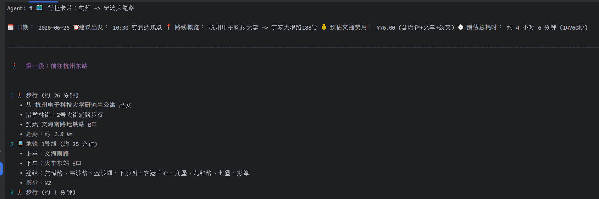

# tglm
这是一个旅游规划agent，无实际用途，只是通过这个项目让我学到东西，使用效果如下

因为路径规划纯靠高德地图api实现，在高德地图也能实现该效果，故无使用价值。

# 我从这里面学到了什么
这个项目一开始让glm5.2 ai生成，然后又接着让他生成了详细文档，看完之后确实受益良多，了解了LangGraph架构。
也学到了tools使用，路由分支（条件边）。但是缺少记忆管理，mcp使用，多agent协作等等。
缺乏的这部分仍然等待学习使用。希望后面每个项目都能让我学到一些东西。